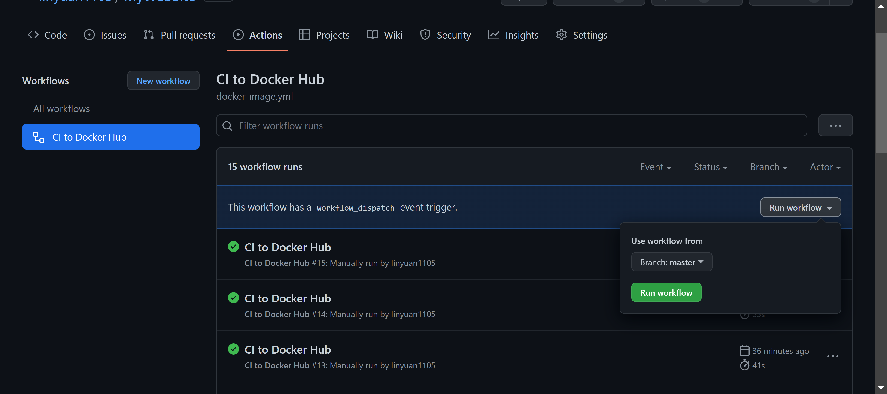
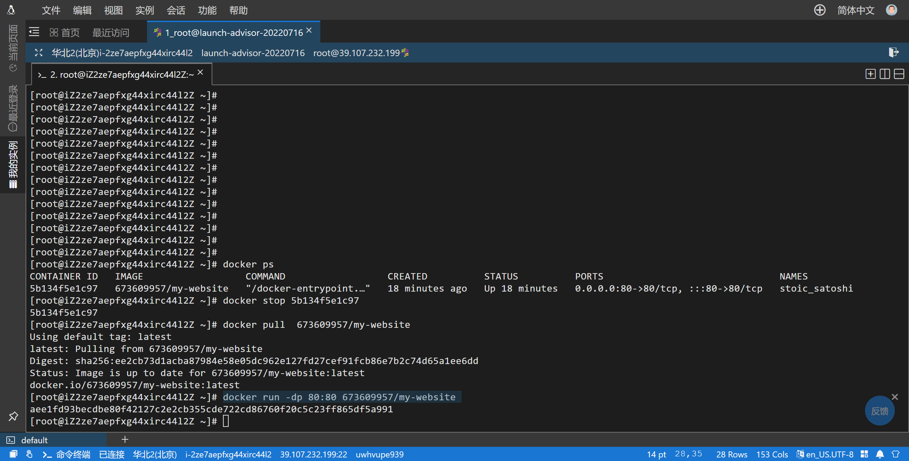

## 部署方式

## 本地构建
```javascript
npm build
```

## 执行工作流
[actions](https://github.com/linyuan1105/MyWebSite/actions)




## docker部署

```javascript
// 查看容器
docker ps  

// 关闭容器
docker stop <CONTAINER ID>

// 更新内容
docker pull  673609957/my-website

// 本地创建nginx配置
mkdir -p /data/nginx
mkdir -p /data/nginx/conf
mkdir -p /data/nginx/logs

// 将当前运行的容器的nginx配置复制到本地
docker cp 6f37f231a7c1:/etc/nginx/nginx.conf /data/nginx/
docker cp 6f37f231a7c1:/etc/nginx/conf.d /data/nginx/conf/
docker cp 6f37f231a7c1:/var/log/nginx/ /data/nginx/logs/

//  移除关闭容器
docker stop <CONTAINER ID> #停止容器
docker rm <CONTAINER ID> #移除容器

//运行容器
// 替换nginx配置
docker run
-p 80:80  
-v /data/nginx/nginx.conf:/etc/nginx/nginx.conf 
-v /data/nginx/conf/conf.d/:/etc/nginx/conf.d  
-v /data/nginx/logs/:/var/log/nginx/ --privileged=true
-d 673609957/my-website

```



##  问题
>  如何构建[docker_nginx](https://hub.docker.com/_/nginx);
需要利用docker构建nginx，构建完成后再进行部署，在处理一些列的问题。
> 

## [代码规范](https://github.com/linyuan1105/MyWebSite/blob/master/.eslintrc.js)
参考 [Airbnb JavaScript Style Guide](https://github.com/linyuan1105/javascript)


